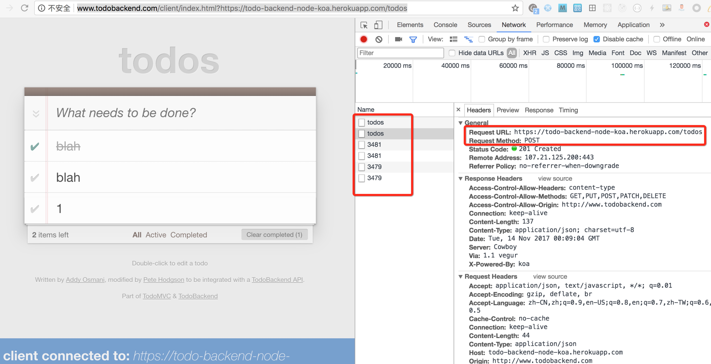

# 作业内容
在第三次的作业基础上，实现连接后端API，数据存放到服务器端。
* 熟悉前后端分离的开发方式和Restful接口
* 实现后端API接口
* 在作业三里添加API访问代码，完成数据存放到服务器端
* 本次作业无需实现服务器端登录功能， 可保留作业三里的本地模拟登录

## 后端API
后端接口可以有三种方式：
1. 自己实现

2. 使用[Todo-Backend](https://www.todobackend.com/)里的实现方式
* 从https://www.todobackend.com/ 下载一个自己熟悉的语言或框架的后端接口，比如Node.js + Koa
* 自己在本地启动API服务器，或者部署服务器上
* 读懂后端API代码， 找到API的调用方式，注意服务器端如何配置的CORS Headers等
* 由于https://www.todobackend.com/ 接口未实现登录注册功能， 本次作业无需实现服务器端登录功能， 可保留作业三里的本地模拟登录

3. 直接使用[Todo-Backend](https://www.todobackend.com/)里别人部署好的接口
比如https://todo-backend-node-koa.herokuapp.com/todos ， 可以结合代码以及抓包分析的方式找到增删改查几个接口。

# 作业要求
* **数据通过Restful接口存放在服务器端**
* 必须用react router
* 代码格式化，变量命名有意义，目录文件划分结构清晰
* 不允许出现var
* 不允许直接操作DOM结构，包括使用jQuery, document.getElementById, document.querySeletor等
* 不允许单独使用CSS文件， 样式必须使用Styled Components
* 用到的小图标请在http://iconfont.cn/ 上找

# 评分标准
* 有详细的README.md文件说明
* 功能是否完整
* 代码清晰易懂
* UI仿真性越高越好
* 上传无关文件扣分
* 尽量多地使用ES6特性，有加分
* 没有errors, 没有warnings
* 支持手机端有加分

# 截止日期
* 2017-11-15 20:00
* 以此时间点之前发起的pull request有效， 之后**commit的代码评分的时候不计算在内。** 
* 此时间点之前没有发起pull request，算本次作业未提交

# 提交方式
* fork本repo
* 在`4-backend`目录下以自己名字拼音建立目录，在目录里面提交完整代码
* 发起`pull request`